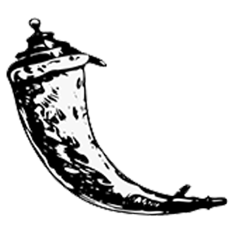
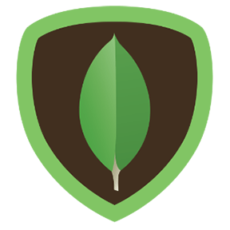
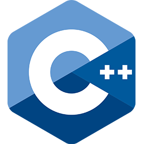
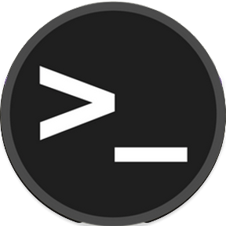
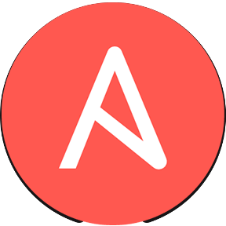
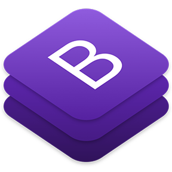
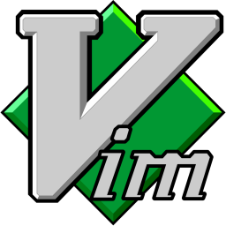
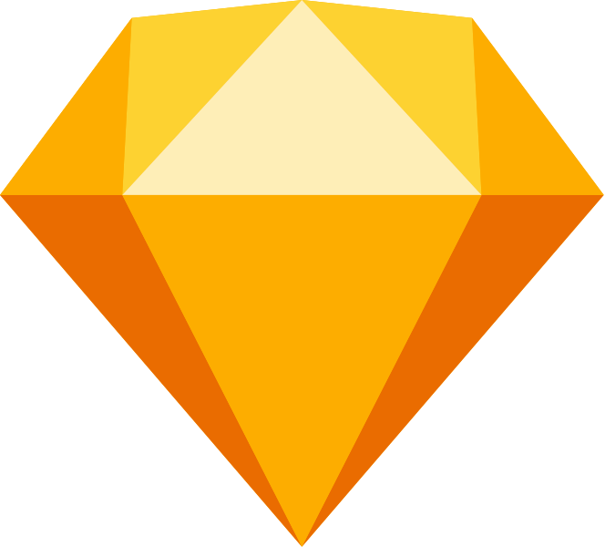

### Hi there, my name is Alex 👋

I’m a Romanian 🇷🇴 Computer Science student who likes to work on different projects where I combine programming and design together. I also like to participate at a lot of contests/hackathons and to contribute to open source projects.

### Social Links:

[][website]
[][linkedin]
[][medium]
[][pagure]
[][devto]
[][instagram]
[][twitter]
[][facebook]

 

### Languages and Tools:

  

[website]: https://alexmarginean.me
[linkedin]: https://www.linkedin.com/in/alexandrumarginean/
[medium]: https://medium.com/@alexmarginean
[pagure]: https://pagure.io/user/margi
[devto]: https://dev.to/alexmarginean16
[instagram]: https://instagram.com/alexmarginean
[twitter]: https://twitter.com/alexmarginean16
[facebook]: https://www.facebook.com/alexandru.marginean.9/

<!--
**alexmarginean16/alexmarginean16** is a ✨ _special_ ✨ repository because its `README.md` (this file) appears on your GitHub profile.

Here are some ideas to get you started:

- 🔭 I’m currently working on ...
- 🌱 I’m currently learning ...
- 👯 I’m looking to collaborate on ...
- 🤔 I’m looking for help with ...
- 💬 Ask me about ...
- 📫 How to reach me: ...
- 😄 Pronouns: ...
- ⚡ Fun fact: ...
-->
